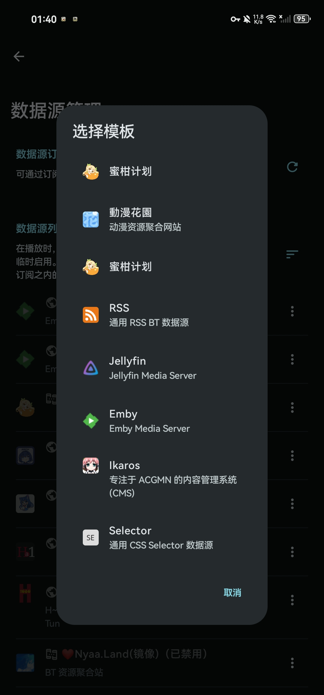

<h1 align="center">数据源</h1>

## 1. 定义
提供数据的网站统称为数据源，理论上只要没有入站检测(要输验证码/机器人检测)的网站大多都可以编写数据源

## 2. 获取途径
#### ⑴ Animeko官方(内置源)
> https://sub.creamycake.org/v1/bt1.json
	
> https://sub.creamycake.org/v1/css1.json
#### ⑵ 第三方分享
> https://gitee.com/wan0ge/extract-pure-links/raw/Ani_Pages/H.json
    
> https://masofod.github.io/anibt.json
    
> https://raw.githubusercontent.com/Nier4ever/ani-sub/main/css.json
#### ⑶ 自己编写

## 3. Animeko支持的数据源类型

1. 蜜柑计划(源站，大陆需代理，内置数据源，不可编辑)
2. 动漫花园(源站，大陆需代理，内置数据源，不可编辑)
3. 蜜柑计划CN(镜像站，大陆可直连，内置数据源，不可编辑)
4. RSS BT数据源(追求画质用这个)
5. Jellyfin Media Server(支持不完善，能用)
6. Emby Media Server(支持不完善，能用)
7. Ikaros CMS(目前处于开发阶段，功能不够完善，不推荐)
8. CSS Selector数据源(追求流畅用这个)

## 4. 编写CSS Selector数据源所需知识与工具
#### ⑴ HTML标签(难度:低)
> 推荐看[HTML标签](https://www.w3school.com.cn/tags/index.asp)，简单了解即可
#### ⑵ CSS选择器(难度:低)
> 推荐看[CSS选择器](https://www.runoob.com/cssref/css-selectors.html)，根据说明动手尝试
#### ⑶ 正则表达式(难度:高)
> 推荐看[正则表达式语法](https://stackoverflow.org.cn/regexsucha)，配合[正则表达式测试工具](https://stackoverflow.org.cn/regex)学习，实在学不会可以问AI
#### ⑷ 网页开发者工具(难度:中)
> 安卓系统推荐使用[Kiwi浏览器](https://github.com/kiwibrowser/src.next/releases/latest)，内置完整功能的开发者工具
> 桌面系统随意，基本所有桌面浏览器都有开发者工具
#### ⑸ JSON语法(难度:低)
> 推荐看[JSON语法](https://www.runoob.com/json/json-syntax.html)，能看懂就行，便于脱离Animeko修改数据源配置

## 5. 编写RSS BT数据源所需知识与工具
#### ⑴ HTML标签(难度:低)
#### ⑵ CSS选择器(难度:低)
#### ⑶ 网页开发者工具(难度:中)

## 6. 编写Jellyfin与Emby数据源所需知识与工具 
#### ⑴ 网页开发者工具 或 抓包工具
> 安卓抓包工具推荐使用[ProxyPin](https://github.com/wanghongenpin/proxypin/releases/latest)，开源免费，功能齐全

## 7. 实战: CSS Selector数据源编写

## 8. 实战: RSS BT数据源编写

## 9. 实战: Emby数据源编写(Jellyfin相同)
