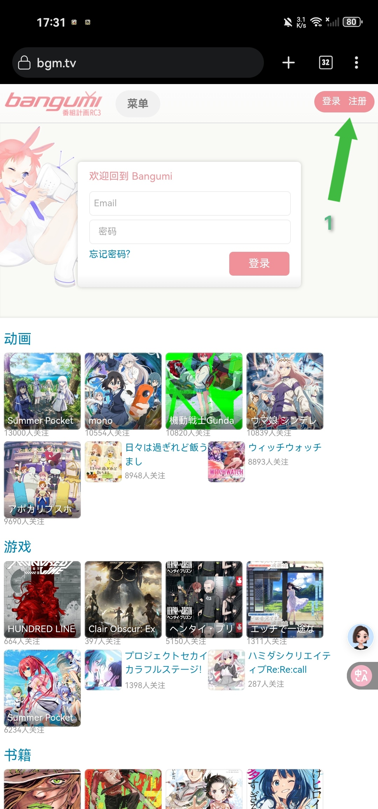
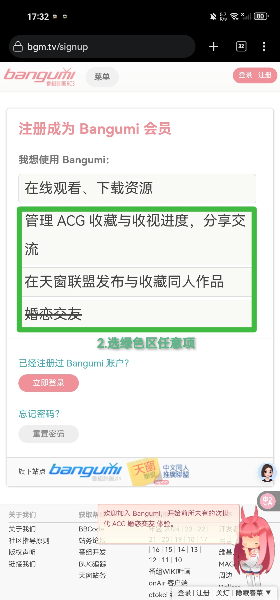
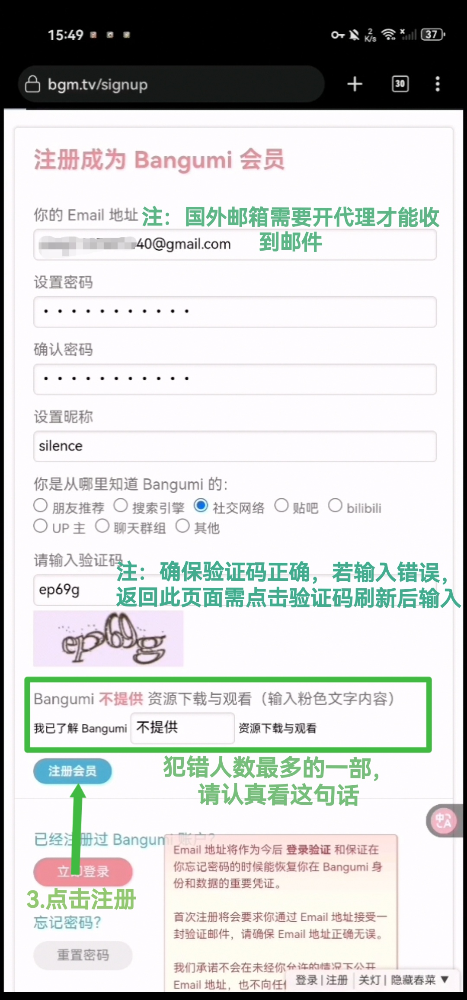
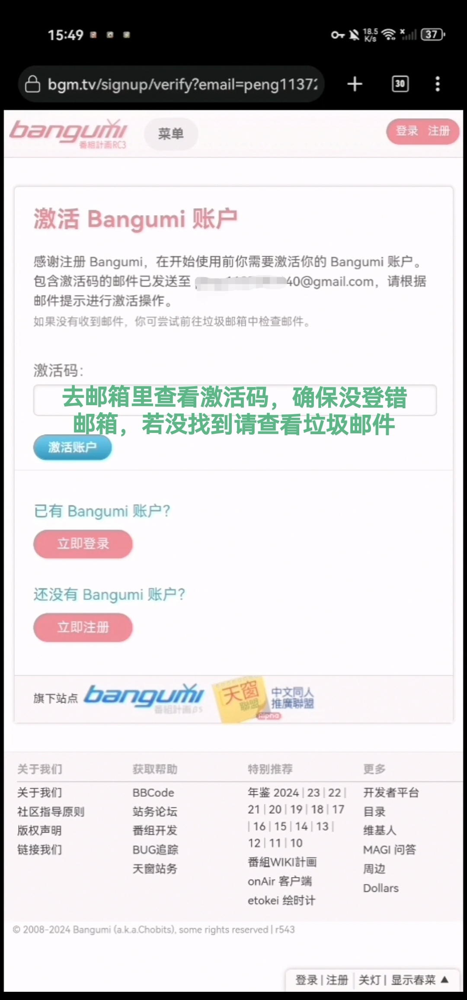
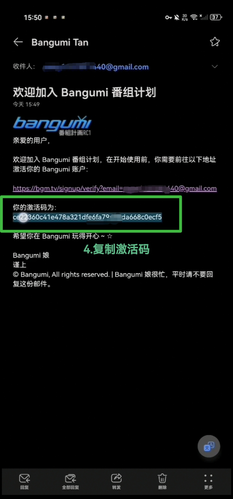
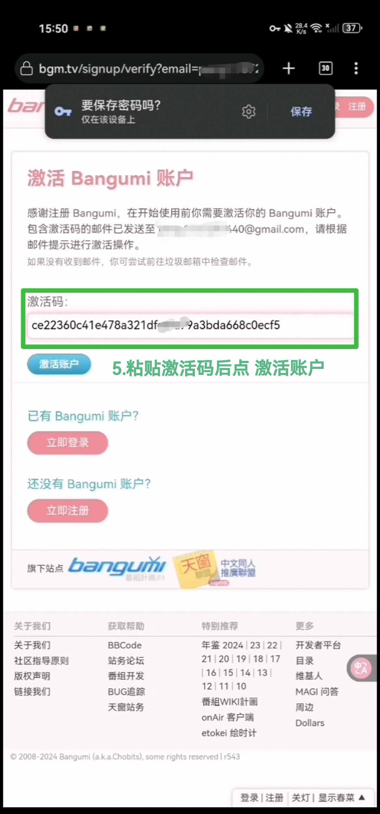

# animeko-guide
由于很多小白用animeko碰到各种问题，无法自己解决，于是便有了这个仓库。
# animeko是什么？
animeko是一个基于bangumi信息平台的在线追番的免费开源软件。
- 基本功能：追番进度同步/在线看番/番剧下载/聚合弹幕
- 运作流程：从bangumi获取条目信息 >从多个动漫网站搜索条目 >解析获取的剧集列表 >解析视频链接并播放
> 所以别再问 怎么切换分辨率？怎么切换字幕？之类的问题了，视频来自第三方网站，画质与字幕取决于来源网站。
# 第一步：bangumi账号注册
鉴于很多人之前没用过bangumi，这里还是有必要讲一下，有账号的请跳过。
## 在浏览器中访问[bangumi](http://bangumi.tv)，按图片中流程操作
> 如果提示 该网站被举报，根据法律规定禁止访问 之类的，请更换浏览器，Kiwi/Edge/Firefox/Chrome/Yandex/Via/X 等浏览器任选。

|  |  |
|:--------------------:|:---------------------:|

|  |  |
|:--------------------:|:---------------------:|

|  |  |
|:--------------------:|:---------------------:|

> 在animeko中登录bangumi时确保页面显示的是移动端视图，如果是桌面端视图会导致授权失败，请手动点击右上角，取消勾选 桌面版网站 再登录授权。
